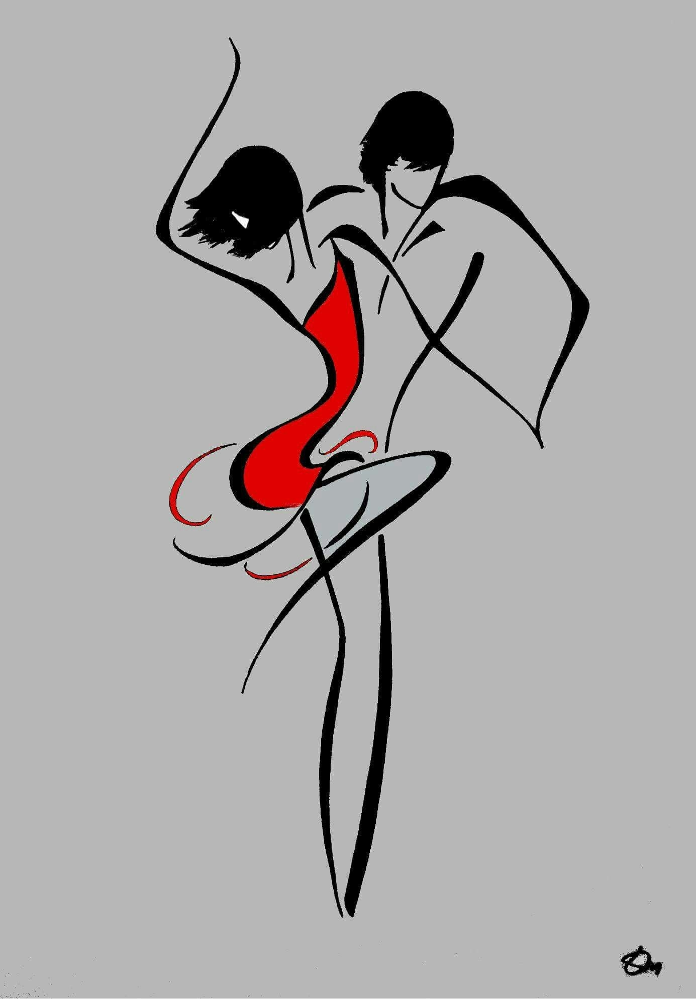

*" Танец - единственное искусство, материалом которого служим мы сми". Т.Шон*

# ПОЛНЫЙ КУРС ОБУЧЕНИЯ БАЧАТЕ

**(10 месяцев по уровням)**

* Базовый (3 месяца)
* Средний (2 месяца)
* Старший (3 месяца)
* PRO (2 месяца)

_**Базовый уровень**_

(постура, перенос веса, техника шага; освоение базовых фигур, навыки ведения/следования, основы ритмичности, импровиация с базовыми фигурами)

*Средний уровень*

(освоение более сложных фигур: волны, футворки, синкопы; ЖС: руки; более углубленное изучение музыкальности; знакомство с направлениями: традиционная, сеншуал; посещение вечеринок, опенов)

*Старший уровень*

(освоение более сложных фигур: поддержки, вращения; украшения в паре,. МС и ЖС: руки, степы более углублённоеизучение направлений; посещение фестивалей)

*PRO*

(отработка - импровизация со сложными элементами; постановка и съёмка выпускной хореографии)
